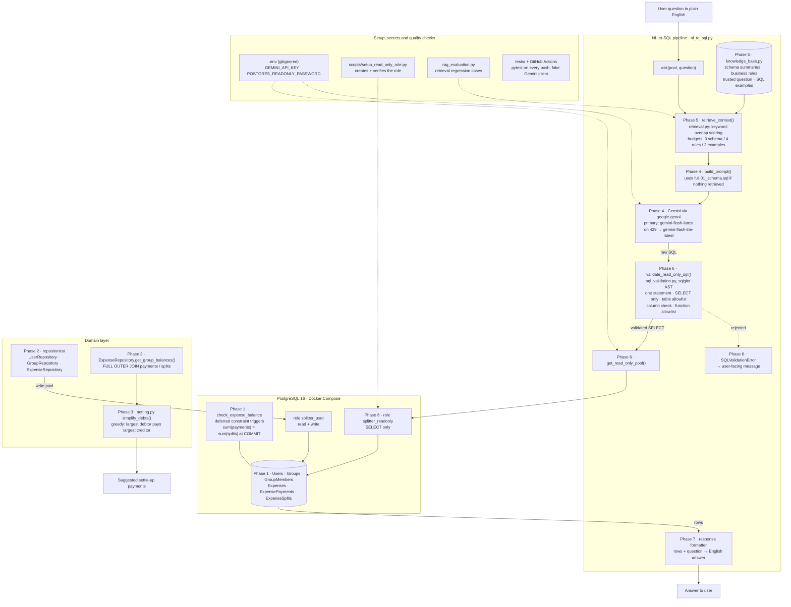

```mermaid
flowchart TD
    Q["User question in plain English"] --> ASK

    subgraph NL["NL-to-SQL pipeline · nl_to_sql.py"]
        ASK["ask(pool, question)"]
        RET["Phase 5 · retrieve_context()<br/>retrieval.py: keyword-overlap scoring<br/>budgets: 3 schema / 4 rules / 2 examples"]
        KB[("Phase 5 · knowledge_base.py<br/>schema summaries · business rules<br/>trusted question→SQL examples")]
        PROMPT["Phase 4 · build_prompt()<br/>uses full 01_schema.sql if nothing retrieved"]
        LLM["Phase 4 · Gemini via google-genai<br/>primary: gemini-flash-latest<br/>on 429 → gemini-flash-lite-latest"]
        VAL["Phase 6 · validate_read_only_sql()<br/>sql_validation.py, sqlglot AST<br/>one statement · SELECT only · table allowlist<br/>column check · function allowlist"]
        ERR["Phase 6 · SQLValidationError<br/>→ user-facing message"]
        POOL["Phase 6 · get_read_only_pool()"]
        FMT["Phase 7 · response formatter<br/>rows + question → English answer"]
    end

    ASK --> RET
    KB --> RET
    RET --> PROMPT --> LLM
    LLM -->|raw SQL| VAL
    VAL -.->|rejected| ERR
    VAL -->|validated SELECT| POOL

    subgraph DB["PostgreSQL 16 · Docker Compose"]
        TABLES[("Phase 1 · Users · Groups · GroupMembers<br/>Expenses · ExpensePayments · ExpenseSplits")]
        TRIG["Phase 1 · check_expense_balance<br/>deferred constraint triggers<br/>sum(payments) = sum(splits) at COMMIT"]
        RO["Phase 6 · role splitter_readonly<br/>SELECT only"]
        RW["role splitter_user<br/>read + write"]
    end

    POOL --> RO --> TABLES
    TABLES -->|rows| FMT --> ANS["Answer to user"]
    TRIG --- TABLES

    subgraph APP["Domain layer"]
        REPOS["Phase 2 · repositories/<br/>UserRepository · GroupRepository · ExpenseRepository"]
        BAL["Phase 3 · ExpenseRepository.get_group_balances()<br/>FULL OUTER JOIN payments / splits"]
        NET["Phase 3 · netting.py simplify_debts()<br/>greedy: largest debtor pays largest creditor"]
    end

    REPOS -->|write pool| RW --> TABLES
    BAL --> NET --> SETTLE["Suggested settle-up payments"]

    subgraph SUPPORT["Setup, secrets and quality checks"]
        ENV[".env (gitignored)<br/>GEMINI_API_KEY · POSTGRES_READONLY_PASSWORD"]
        SETUP["scripts/setup_read_only_role.py<br/>creates + verifies the role"]
        EVAL["rag_evaluation.py<br/>retrieval regression cases"]
        CI["tests/ + GitHub Actions<br/>pytest on every push, fake Gemini client"]
    end

    ENV -.-> LLM
    ENV -.-> POOL
    SETUP -.-> RO
    EVAL -.-> RET
```
